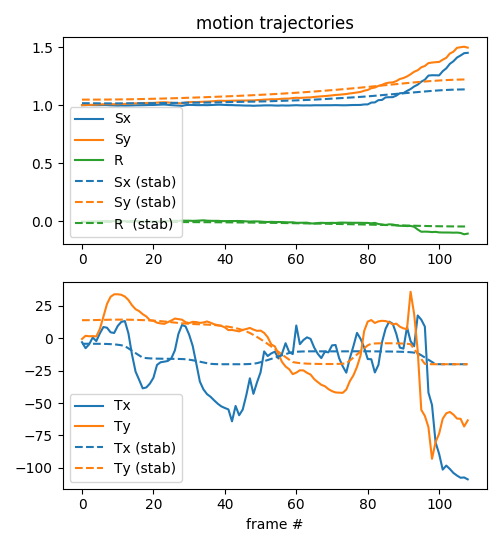

# Offline Optimization-based Video Stabilizer
Here I have implemented an offline video stabilizer that places customizable constraints on maximum camera translation, rotation, and zoom, and enforces smooth motion by regularizing the first and second order finite differences (velocity, acceleration) of the camera motion parameters, while optimizing the smoothed camera motion to emulate the original camera motion (intentional camera movements).

<table>
  <tr>
    <td align="center" width="50%">
      
    </td>
    <td align="center" width="50%">
      
    </td>
  </tr>
  <tr>
    <td align="center">
      top: <em>original</em>; bottom: <em>stabilized</em>
    </td>
    <td align="center">
      solid: <em>original</em>; dashed: <em>stablized</em>
    </td>
  </tr>
</table>

A convex objective is formulated and solved using the FISTA (fast iterative shrinkage and thresholding) algorithm which has been successfully used to solve many large-scale convex optimization problems.

OpenCV is used to extract image features for each video frame, establish a robust correspondence between the features of adjacent frames, and estimate the affine camera motion parameters (translation, rotation, and scale/zoom). Once motion parameters are extracted for every frame, the motion sequence is optimized using FISTA to produce the smoothed camera motion, while still capturing the original intent of the video. Finally, the smoothed camera motion is applied to the video sequence to obtain a stabilized result, free from annoying shakes and jitters.

_~Note:_ I have not implemented any auto-cropping, so you will currently see the stabilized footage as a _floating_ video frame on a black background. In practice (such as on your phone), the stabilized video output is usually zoomed by a small amount (1.1-1.2x?), even while recording to indicate an accurate field of view once stabilization has been performed. By leaving the size at 1x, I think this example serves as a more instructive visualization.

Additional details provided in the [report](https://github.com/ryanneph/VideoStabilizer/blob/master/submission/neph_ee236c_report.pdf) and on my [website](https://ryanneph.netlify.com/experience/video-stabilization).

---
#### Stabilization Example

To duplicate this example on your system you can run the following commands:
```bash
git clone https://github.com/ryanneph/VideoStabilizer
cd VideoStabilizer/
virtualenv --python python3 venv
source venv/bin/activate
python -m pip install -r requirements.txt
python main.py samples/1_train.mp4 --out stabilized_example.mp4 --smoothness 100
```
You can optionally add `-L DEBUG` and/or `--vis` as arguments to see more details of the stabilization process.
